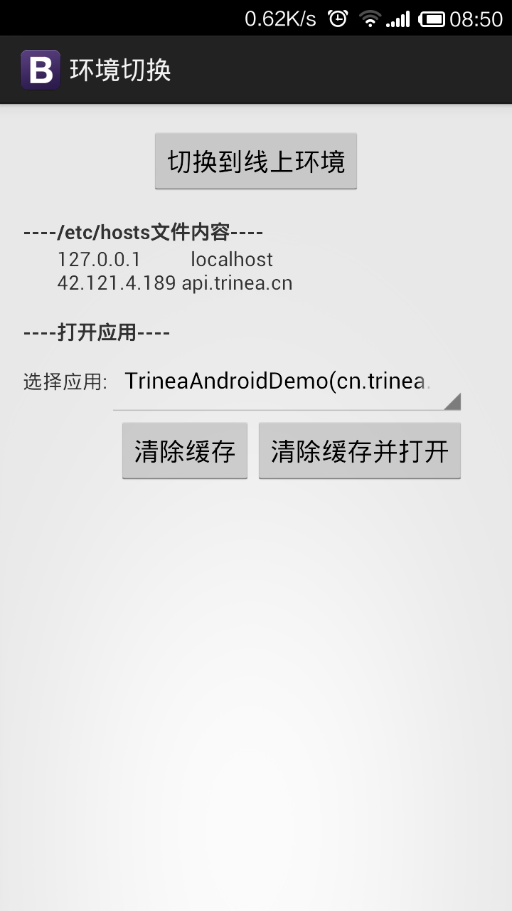

Android 开发测试环境切换工具
====================================
`一年前周末花半天写的，用着没太多其他需求就没怎么改进，现在源码开放出来，需要的话可以提交 Request 添加更复杂需求`  
### 1. 功能介绍  
现在大多开发人员都是通过程序中 isDebug 变量表示是否是 Debug 模式，从而确定后台服务器是接入测试环境还是开发环境  
 
那么如果没有程序代码呢？如果是已上线某个老版本呢？  
 
这个项目的主要功能是修改 Host 文件，从而达到将对线上环境的访问全部指向到测试环境的目的  
`PS：手机必须开启了 Root 权限`  

  
### 2. 如何设置
在 SD 卡根目录下 Trinea 文件夹内新建文件 switch-env-host.txt，内容为测试环境和开发环境对应的 Host  
在 SD 卡根目录下 Trinea 文件夹内新建文件 switch-env-app-info.txt，内容为 App 信息，每行信息为包名 空格 应用名  

